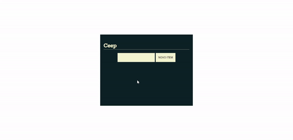
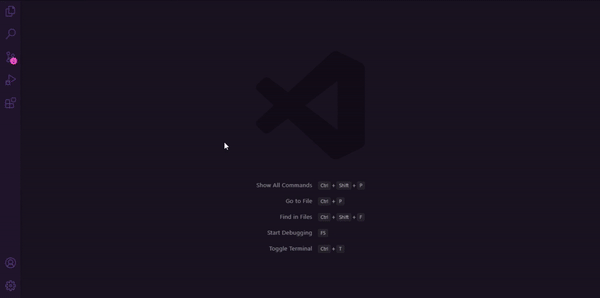
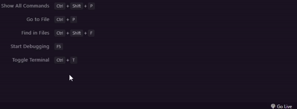

# Ceep

Project created in one of Alura's Javascript courses to learn how to manipulate the DOM with JavaScript. <br />

In it I learned how: <br />

- DOM works;
- Manipulate the DOM to change, add, remove and create new elements in the object tree;
- Work with componentization to facilitate the organization of the project;
- Use the Javascript module system to protect files.

# Overview



# How to run

```
# Clone this repository
$ git clone https://github.com/velleeda/Ceep

# Go to the directory
$ cd Ceep

# Install Live Server via NPM
$ npm install -g live-server

# Run Live Server via NPM
$ live-server

```

## Install Live Server via VS Code



## Run Live Server via VS Code


